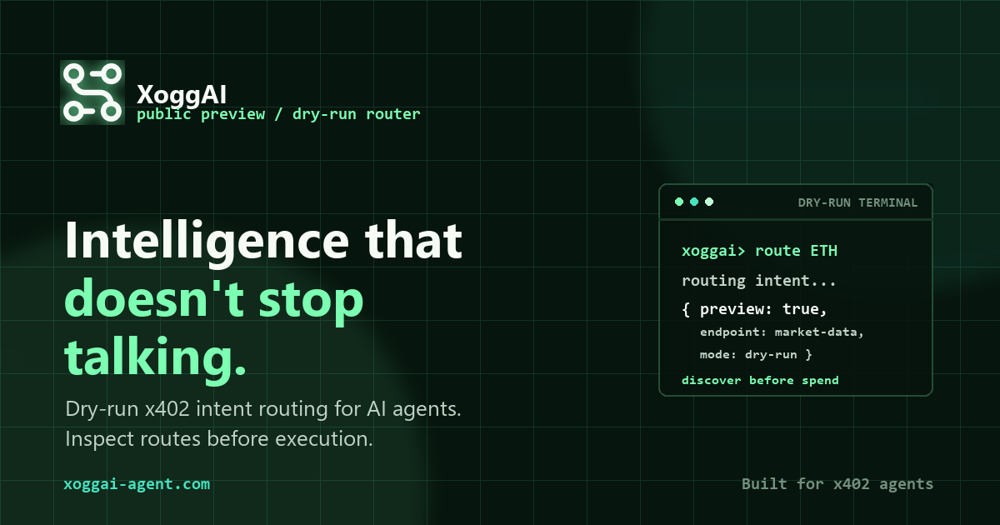

<p align="center">
  
</p>

<h1 align="center">XoggAI</h1>

<p align="center">
  Intelligence becomes action.
</p>

<p align="center">
  <a href="https://xoggai-agent.com"></a>
  <a href="https://xoggai-agent.com/docs"></a>
  <a href="https://xoggai-backend.onrender.com"></a>
  <a href="docs/TESTNET_PRODUCT_STATUS.md"></a>
</p>

XoggAI is a production-grade testnet beta that lets AI agents route natural-language intent into x402 API execution.

Agents can discover the right endpoint, inspect pricing and metadata first, then move into a gated Base Sepolia execution flow only after approval. Mainnet is intentionally disabled.

<p align="center">
  <a href="https://xoggai-agent.com">
    
  </a>
</p>

## Live Product

- Website: [xoggai-agent.com](https://xoggai-agent.com)
- Beta console: [xoggai-agent.com/beta](https://xoggai-agent.com/beta/)
- Developer docs: [xoggai-agent.com/docs](https://xoggai-agent.com/docs)
- Connect agent kit: [xoggai-agent.com/connect-agent](https://xoggai-agent.com/connect-agent/)
- Backend API: [xoggai-backend.onrender.com](https://xoggai-backend.onrender.com)

Current status: production-grade public testnet beta on Base Sepolia. See [docs/TESTNET_PRODUCT_STATUS.md](docs/TESTNET_PRODUCT_STATUS.md).

## Why XoggAI

AI agents should not execute blindly.

XoggAI gives agents a guarded routing layer:

```text
plain-English intent
-> ranked x402 endpoint preview
-> endpoint price, latency, rating, and schema
-> approved Base Sepolia execution
-> user-visible proof and audit trail
```

The product is built for testnet-first validation. Users can try the flow, operators can control execution, and developers can integrate agents without exposing wallet secrets in browser code.

## Product Surface

| Surface | What it does |
| --- | --- |
| Public website | Product narrative, terminal demo, docs entry points |
| Beta console | User request creation, quota view, lifecycle tracking |
| Operator console | Private approval, rejection, cancellation, and execution controls |
| Backend API | Intent routing, endpoint search, beta execution lifecycle, status feeds |
| Developer kit | JS helper, curl examples, agent instructions, OpenAPI, `skill.md`, `llms.txt` |

## Current Safety Boundary

- Network: Base Sepolia only.
- Public routing is dry-run-first.
- Execution requires beta access and operator approval.
- Requests expire before execution.
- Per-user and per-request budgets are enforced server-side.
- Endpoint execution is allowlisted.
- Browser code never receives wallet private keys, beta execution keys, or admin keys.
- Mainnet payment execution is not enabled.

## Quick API Test

```powershell
curl.exe https://xoggai-backend.onrender.com/health
curl.exe "https://xoggai-backend.onrender.com/intent?q=what%20is%20the%20ETH%20price&budget=0.005&dry=true"
```

Expected behavior: dry-run routing response. Public API demos do not send payment.

## Minimal Agent Integration

```ts
const XOGGAI_API = 'https://xoggai-backend.onrender.com';

export async function routeIntent(intent: string, budget = 0.005) {
  const url = new URL(`${XOGGAI_API}/intent`);
  url.searchParams.set('q', intent);
  url.searchParams.set('budget', String(budget));
  url.searchParams.set('dry', 'true');

  const response = await fetch(url);
  if (!response.ok) throw new Error(`XoggAI route failed: ${response.status}`);
  return response.json();
}
```

More integration examples live in:

- [frontend/examples/xoggai-sdk.js](frontend/examples/xoggai-sdk.js)
- [frontend/examples/curl.md](frontend/examples/curl.md)
- [frontend/examples/claude.md](frontend/examples/claude.md)
- [frontend/examples/codex.md](frontend/examples/codex.md)
- [frontend/examples/cursor.md](frontend/examples/cursor.md)

## Local Development

```powershell
npm install
docker compose up -d db redis
npm run db:local:init
npm run seed
npm run dev
```

Serve the frontend:

```powershell
npm run frontend:serve
```

Run the release checks:

```powershell
npm test
npm audit --omit=dev
npm run production:check
npm run phase14:qa
git diff --check
```

## Repository Map

- [src](src) - backend API, routing, beta execution, x402 services.
- [frontend](frontend) - public website, docs UI, beta console, operator console.
- [frontend/examples](frontend/examples) - copyable developer integration examples.
- [scripts](scripts) - QA, admin, operator, backup, and deployment helpers.
- [docs](docs) - roadmap phases, runbooks, launch QA, status, and operations.
- [SECURITY.md](SECURITY.md) - safety boundary and reporting guidance.
- [render.yaml](render.yaml) - Render Blueprint for backend, database, and key/value store.
- [netlify.toml](netlify.toml) - Netlify static frontend deploy config.

Start with [docs/README.md](docs/README.md) for the full documentation index.
Use [docs/GITHUB_PROFILE.md](docs/GITHUB_PROFILE.md) for the recommended GitHub
About description, website, and topics.

## Roadmap Status

XoggAI has completed the production-grade testnet beta path through Phase 14:

- Developer integration kit
- Testnet reliability and abuse controls
- Final launch QA
- Public beta console
- Private operator console
- Base Sepolia controlled execution

Next major work is a separate mainnet migration phase. It is intentionally not enabled in this repository state.

## License

No open-source license is currently provided.
